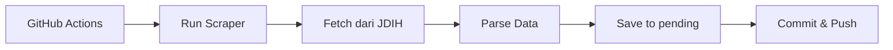
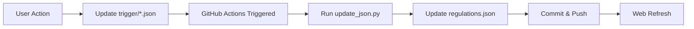

# 📋 Portal Peraturan ESDM, KLHK & Perda

Portal web untuk mengakses dan mengelola peraturan-peraturan terbaru dari:
- **ESDM** (Kementerian Energi dan Sumber Daya Mineral)
- **KLHK** (Kementerian Lingkungan Hidup dan Kehutanan)
- **Perda** (Peraturan Daerah - Sulut, Kaltara, Kaltim, Papua, NTB)

## ✨ Fitur Utama

### 🔄 Auto-Scraper
- Scraping otomatis dari JDIH ESDM & KLHK setiap hari pukul 01:00 WIB
- Scraping Perda setiap Minggu pukul 02:00 WIB
- Peraturan baru masuk ke status "Pending Review"

### 👥 Mode Publik
- Browse semua peraturan yang sudah dipublikasikan
- Filter berdasarkan kementerian dan kategori
- Pencarian full-text
- Link langsung ke dokumen resmi

### 🔐 Mode Admin
- Review peraturan baru (Approve/Reject)
- Tambah peraturan lama secara manual
- Hapus peraturan yang tidak relevan
- Semua aksi langsung trigger GitHub Actions

## 🚀 Cara Deploy

### 1. Fork Repository Ini

Klik tombol **Fork** di GitHub untuk membuat copy repo ini ke akun Anda.

### 2. Setup GitHub Pages

1. Buka **Settings** → **Pages**
2. Source: Deploy from a branch
3. Branch: `main` → folder `/` (root)
4. Klik **Save**

### 3. Aktifkan GitHub Actions

1. Buka tab **Actions**
2. Klik "I understand my workflows, go ahead and enable them"
3. Workflows akan otomatis berjalan sesuai jadwal

### 4. Konfigurasi (Opsional)

Edit file-file berikut jika perlu:

**`.scripts/scraper_perda.py`** - Ubah daftar provinsi:
```python
provinces = [
    ("https://jdih.sulutprov.go.id/", "Sulawesi Utara"),
    ("https://jdih.kaltaraprov.go.id/", "Kalimantan Utara"),
    # Tambahkan provinsi lain...
]
```

**`.github/workflows/scraper.yml`** - Ubah jadwal scraping:
```yaml
on:
  schedule:
    - cron: '0 1 * * *'  # Ubah ke jadwal yang Anda inginkan
```

### 5. Akses Website

Website akan tersedia di: `https://[username].github.io/[repo-name]/`

Contoh: `https://ARAM0004.github.io/peraturan-esdm-klhk/`

## 📁 Struktur Folder

```
peraturan-esdm-klhk/
├── .github/workflows/          # GitHub Actions workflows
│   ├── scraper.yml            # Auto-scraper ESDM & KLHK
│   ├── scraper_perda.yml      # Auto-scraper Perda
│   ├── update_manual.yml      # Handle update dari web
│   └── delete-trigger.yml     # Handle delete dari web
├── .scripts/                   # Python scripts
│   ├── scraper.py             # Scraper ESDM & KLHK
│   ├── scraper_perda.py       # Scraper Perda
│   ├── update_json.py         # Process web actions
│   ├── delete_regulation.py   # Delete handler
│   └── requirements.txt       # Python dependencies
├── trigger/                    # Trigger files untuk web interface
│   ├── update.json            # Update/approve trigger
│   └── delete_trigger.json    # Delete trigger
├── index.html                  # Main web interface
├── regulations.json            # Database peraturan
├── netlify.toml               # Config untuk Netlify (opsional)
└── README.md                  # Dokumentasi
```

## 🔧 Cara Kerja Sistem

### Workflow Auto-Scraper



### Workflow Web Interface



## 🎯 Cara Menggunakan

### Sebagai User Biasa

1. Buka website
2. Browse peraturan yang tersedia
3. Gunakan filter dan pencarian
4. Klik link untuk download dokumen resmi

### Sebagai Admin

1. Klik tombol **"🔐 Mode Admin"**
2. Review peraturan baru di tab **"Pending Review"**
3. Approve atau reject peraturan
4. Tambah peraturan lama jika perlu
5. Hapus peraturan yang tidak relevan

**⚠️ Catatan:** 
- Perubahan memerlukan waktu 1-2 menit untuk diproses
- Refresh halaman secara manual untuk melihat update
- Tidak perlu Personal Access Token - sistem menggunakan GitHub Actions

## 🛠️ Troubleshooting

### Scraper Tidak Berjalan

1. Cek tab **Actions** di GitHub
2. Pastikan workflows enabled
3. Cek log error di workflow run yang gagal

### Data Tidak Ter-update di Website

1. Clear browser cache
2. Hard refresh (Ctrl + Shift + R)
3. Tunggu 2-3 menit setelah action

### Trigger File Tidak Bekerja

1. Cek apakah workflow `update_manual.yml` berjalan
2. Pastikan format JSON di trigger file benar
3. Cek permissions di Settings → Actions → Workflow permissions

## 📊 Kategori Peraturan

- 📋 **Perizinan** - Tata cara izin dan persetujuan
- 🌱 **Lingkungan** - AMDAL, konservasi, limbah
- ⛑️ **Keselamatan Kerja** - K3, pelindungan pekerja
- ⚒️ **Teknis Pertambangan** - Eksplorasi, eksploitasi
- 🌳 **Reklamasi** - Pascatambang, rehabilitasi
- 💰 **Pajak & Royalti** - Pungutan dan PNBP
- 🏛️ **Perda** - Peraturan Daerah
- 📄 **Lainnya** - Kategori umum

## 🔐 Security & Privacy

- Website bersifat read-only untuk publik
- Tidak ada autentikasi real untuk mode admin (demo purpose)
- Tidak ada data sensitif yang disimpan
- Semua data dari sumber publik (JDIH resmi)

## 📝 License

MIT License - Silakan digunakan dan dimodifikasi sesuai kebutuhan.

## 🤝 Contributing

Kontribusi sangat diterima! Silakan:
1. Fork repository ini
2. Create feature branch
3. Commit changes
4. Push ke branch
5. Create Pull Request

## 📮 Contact

Untuk pertanyaan atau saran, silakan buka Issue di GitHub.

---

**Dibuat dengan ❤️ untuk memudahkan akses peraturan pertambangan Indonesia**
